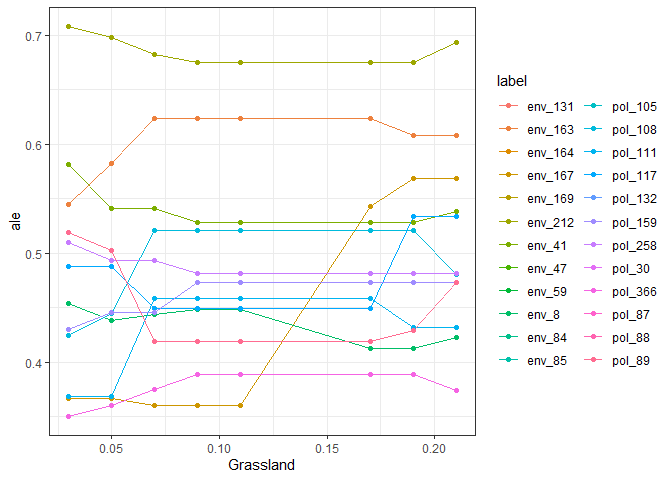
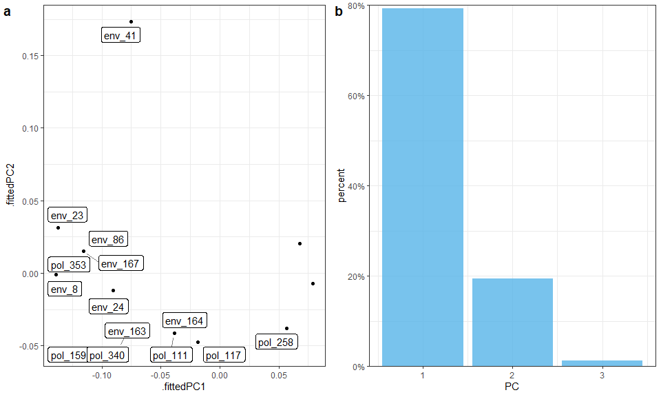
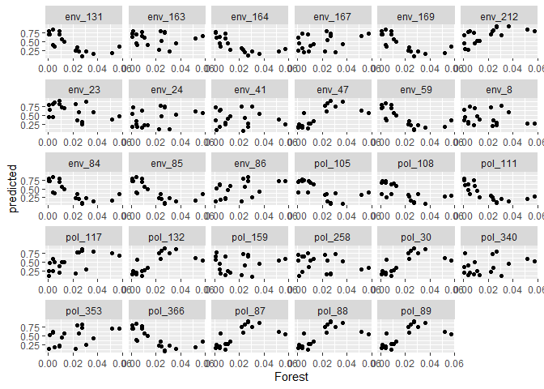
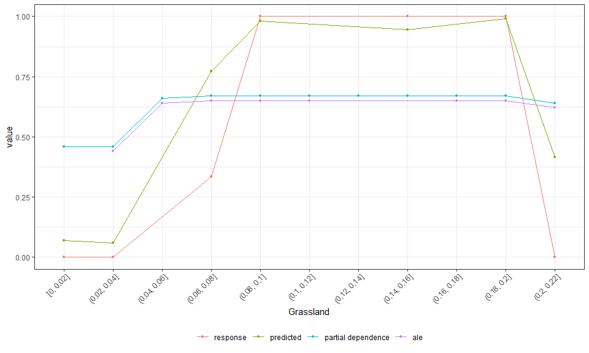
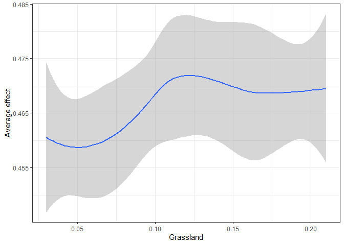
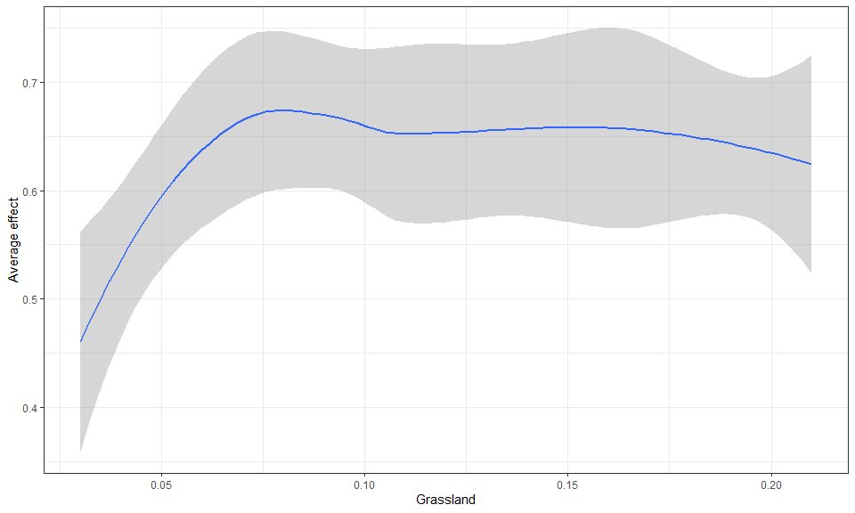

<!-- README.md is generated from README.Rmd. Please edit that file -->

# mrIML: Multivariate (multi-response) interpretable machine learning </a>

<!-- badges: start -->


[](https://github.com/nfj1380/mrIML/actions)
<!-- badges: end -->

This package aims to enable users to build and interpret multivariate
machine learning models harnessing the tidyverse (tidy model syntax in
particular). This package builds off ideas from Gradient Forests [Ellis
et al
2012](https://esajournals-onlinelibrary-wiley-com.prox.lib.ncsu.edu/doi/full/10.1890/11-0252.1)),
ecological genomic approaches [Fitzpatrick and Keller,
2014](https://onlinelibrary.wiley.com/doi/abs/10.1111/ele.12376) and
multi-response stacking algorithms \[Xing et al 2019\].

This package can be of use for any multi-response machine learning
problem, but was designed to handle data common to community ecology
(site by species data) and ecological genomics (individual or population
by SNP loci).

## Recent mrIML publications

1.  Fountain-Jones, N. M., Kozakiewicz, C. P., Forester, B. R.,
    Landguth, E. L., Carver, S., Charleston, M., Gagne, R. B.,
    Greenwell, B., Kraberger, S., Trumbo, D. R., Mayer, M., Clark, N.
    J., & Machado, G. (2021). MrIML: Multi-response interpretable
    machine learning to model genomic landscapes. Molecular Ecology
    Resources, 21, 2766– 2781. <https://doi.org/10.1111/1755-0998.13495>

2.  Sykes, A. L., Silva, G. S., Holtkamp, D. J., Mauch, B. W., Osemeke,
    O., Linhares, D. C.L., & Machado, G. (2021). Interpretable machine
    learning applied to on-farm biosecurity and porcine reproductive and
    respiratory syndrome virus. Transboundary and Emerging Diseases, 00,
    1– 15. <https://doi.org/10.1111/tbed.14369>

## Installation

Install the stable version of the package:

``` r
#install.packages("devtools")
#devtools::install_github('nfj1380/mrIML')
library(mrIML)
```

## Quick start

**mrIML** is designed to be used with a single function call or to be
used in an ad-hoc fashion via individual function calls. In the
following section we give an overview of the simple use case. For more
on using each function see the [function
documentation](https://nfj1380.github.io/mrIML/reference/index.html).
The core functions for both regression and classification are:
[`mrIMLpredicts`](https://nfj1380.github.io/mrIML/reference/mrIMLpredicts.html),
[`mrIMLperformance`](https://nfj1380.github.io/mrIML/reference/mrIMLperformance.html),
and [`mrvip`](https://nfj1380.github.io/mrIML/reference/mrvip.html),
[`mrFlashlight`](https://nfj1380.github.io/mrIML/reference/mrFlashlight.html),
and[`mrProfileplots`](https://nfj1380.github.io/mrIML/reference/mrProfileplots.html).

We also allow users to get bootstrapped estimations of partial
dependencies and variable importance using
[`mrBootstrap`](https://nfj1380.github.io/mrIML/reference/mrBootstrap.html).

The first step to using the package is to load it as follows.

## Model component

Now all the data is loaded and ready to go we can formulate the model
using tidymodel syntax. In this case we have binary data (SNP
presence/absence at each loci) but the data could also be counts or
continuous (the set_model argument would be “regression” instead of
“classification”). The user can specify any model from the ‘tidymodel’
universe as ‘model 1’ (see <https://www.tidymodels.org/find/> for
details). However, we have done most of our testing on random forests
(rf) and glms (generalized linear models). Here we will specify a random
forest classification model as the model applied to each response.

``` r
model_rf <-rand_forest(trees = 100,
              mode = "classification",
              mtry = tune(),
              min_n = tune()) %>% #100 trees are set for brevity. Aim to start with 1000
             set_engine("randomForest")
```

### [`mrIMLpredicts`](https://nfj1380.github.io/mrIML/reference/mrIMLpredicts.html)

This function represents the core functionality of the package and
includes results reporting, plotting and optional saving. It requires a
data frame of X t( the snp data for example) and Y represented by the
covariates or features.

Load example data (cite) data from `{mrIML}`.

``` r
fData <- filterRareCommon (Responsedata,
                           lower=0.4,
                           higher=0.7) 
data <- fData[1:20]
```

## Parallel processing

MrIML provides uses the flexible future apply functionality to set up
multi-core processing. In the example below, we set up a cluster using 4
cores. If you don’t set up a cluster, the default settings will be used
and the analysis will run sequentially.

``` r
# detectCores() #check how many cores you have available. We suggest keeping one core free for internet browsing etc.

cl <- parallel::makeCluster(4)
     plan(cluster,
     workers=cl)
```

``` r
Y <- fData #For simplicity when comparing
#Define set the outcomes of interest
str(Features) 
#> 'data.frame':    20 obs. of  19 variables:
#>  $ Grassland       : num  0.07 0.0677 0.1845 0.0981 0.1578 ...
#>  $ Shrub.Scrub     : num  0.557 0.767 0.524 0.786 0.842 ...
#>  $ Forest          : num  0.01072 0.030588 0.008615 0.000662 0.000616 ...
#>  $ HighlyDev       : num  0 0 0.00225 0 0 ...
#>  $ Urban           : num  0 0 0.00159 0 0 ...
#>  $ Suburban        : num  0.00357 0.13268 0.01325 0.00119 0 ...
#>  $ Exurban         : num  0.00622 0.03019 0 0.01906 0 ...
#>  $ Altered         : num  0.441 0.182 0.114 0.12 0 ...
#>  $ Distance        : num  1.321 0.492 3.231 5.629 4.739 ...
#>  $ Latitude        : num  33.8 33.8 33.8 33.8 33.8 ...
#>  $ Longitude       : num  -118 -118 -118 -118 -118 ...
#>  $ Age             : int  3 0 3 2 3 3 2 3 3 3 ...
#>  $ Sex             : int  1 1 1 1 0 0 0 1 1 1 ...
#>  $ Relatedness.PCO1: num  -0.1194 -0.0389 -0.1618 -0.1811 -0.1564 ...
#>  $ Relatedness.PCO2: num  -0.1947 -0.0525 -0.321 -0.0827 0.1 ...
#>  $ Relatedness.PCO3: num  -0.191 -0.0874 0.0541 -0.0627 -0.0111 ...
#>  $ Relatedness.PCO4: num  0.1117 0.2422 0.0974 0.2129 0.2259 ...
#>  $ Relatedness.PCO5: num  0.06405 0.0706 0.03514 -0.00084 0.0894 ...
#>  $ Relatedness.PCO6: num  -0.0432 0.0683 -0.0805 0.2247 -0.055 ...
#Remove NAs from the feature/predictor data.
FeaturesnoNA<-Features[complete.cases(Features), ]
X <- FeaturesnoNA #For simplicity
#For more efficient testing for interactions (more variables more interacting pairs)
X <- FeaturesnoNA[c(1:3)] #Three features only


yhats_rf <- mrIMLpredicts(X=X,Y=Y, #specify which data to use
                          Model=model_rf, #what model
                          balance_data='no', #balance the data or not 
                          mode='classification', #classification or regression
                          k=5,
                          tune_grid_size=5, #tuning parameters
                          seed = 123,
                          racing=F)  #Set seed
#>   |                                                                              |                                                                      |   0%  |                                                                              |==                                                                    |   3%  |                                                                              |=====                                                                 |   7%  |                                                                              |=======                                                               |  10%  |                                                                              |==========                                                            |  14%  |                                                                              |============                                                          |  17%  |                                                                              |==============                                                        |  21%  |                                                                              |=================                                                     |  24%  |                                                                              |===================                                                   |  28%  |                                                                              |======================                                                |  31%  |                                                                              |========================                                              |  34%  |                                                                              |===========================                                           |  38%  |                                                                              |=============================                                         |  41%  |                                                                              |===============================                                       |  45%  |                                                                              |==================================                                    |  48%  |                                                                              |====================================                                  |  52%  |                                                                              |=======================================                               |  55%  |                                                                              |=========================================                             |  59%  |                                                                              |===========================================                           |  62%  |                                                                              |==============================================                        |  66%  |                                                                              |================================================                      |  69%  |                                                                              |===================================================                   |  72%  |                                                                              |=====================================================                 |  76%  |                                                                              |========================================================              |  79%  |                                                                              |==========================================================            |  83%  |                                                                              |============================================================          |  86%  |                                                                              |===============================================================       |  90%  |                                                                              |=================================================================     |  93%  |                                                                              |====================================================================  |  97%  |                                                                              |======================================================================| 100%

ModelPerf <- mrIMLperformance(yhats=yhats_rf,
                              Model=model_rf,
                              Y=Y,
                              mode='classification')

ModelPerf[[1]] #Predictive performance for individual responses 
#>    response  model_name            roc_AUC                mcc       sensitivity
#> 1   env_131 rand_forest  0.642857142857143  0.327326835353989 0.285714285714286
#> 2   env_163 rand_forest  0.238095238095238 -0.327326835353989                 0
#> 3   env_164 rand_forest  0.895833333333333  0.534522483824849               0.5
#> 4   env_167 rand_forest  0.833333333333333               <NA>                 1
#> 5   env_169 rand_forest  0.642857142857143  0.327326835353989 0.285714285714286
#> 6   env_212 rand_forest  0.444444444444444  0.272165526975909                 1
#> 7    env_23 rand_forest               0.48 -0.333333333333333                 0
#> 8    env_24 rand_forest               0.28               <NA>                 1
#> 9    env_41 rand_forest  0.208333333333333 -0.408248290463863 0.333333333333333
#> 10   env_47 rand_forest               0.86  0.816496580927726                 1
#> 11   env_59 rand_forest  0.642857142857143  0.327326835353989 0.285714285714286
#> 12    env_8 rand_forest            0.78125               <NA>                 0
#> 13   env_84 rand_forest  0.642857142857143  0.327326835353989 0.285714285714286
#> 14   env_85 rand_forest  0.642857142857143  0.327326835353989 0.285714285714286
#> 15   env_86 rand_forest             0.4375               <NA>                 1
#> 16  pol_105 rand_forest  0.854166666666667  0.408248290463863 0.333333333333333
#> 17  pol_108 rand_forest  0.761904761904762  0.327326835353989 0.285714285714286
#> 18  pol_111 rand_forest  0.895833333333333  0.534522483824849               0.5
#> 19  pol_117 rand_forest               0.78  0.654653670707977                 1
#> 20  pol_132 rand_forest               0.86  0.816496580927726                 1
#> 21  pol_159 rand_forest               0.28  0.333333333333333                 1
#> 22  pol_258 rand_forest 0.0833333333333333 -0.356348322549899               0.5
#> 23   pol_30 rand_forest               0.86  0.816496580927726                 1
#> 24  pol_340 rand_forest 0.0952380952380952 -0.218217890235992 0.142857142857143
#> 25  pol_353 rand_forest             0.4375               <NA>                 1
#> 26  pol_366 rand_forest  0.642857142857143  0.327326835353989 0.285714285714286
#> 27   pol_87 rand_forest               0.86  0.816496580927726                 1
#> 28   pol_88 rand_forest               0.86  0.816496580927726                 1
#> 29   pol_89 rand_forest               0.86  0.816496580927726                 1
#>                  ppv       specificity        prevalence
#> 1                  1                 1 0.421052631578947
#> 2  0.714285714285714                 0 0.631578947368421
#> 3                  1                 1 0.421052631578947
#> 4                  0               0.4 0.421052631578947
#> 5                  1                 1 0.421052631578947
#> 6  0.444444444444444 0.166666666666667  0.68421052631579
#> 7                0.8                 0 0.631578947368421
#> 8                  0               0.5 0.421052631578947
#> 9               0.25               0.4 0.473684210526316
#> 10               0.8 0.833333333333333 0.473684210526316
#> 11                 1                 1 0.421052631578947
#> 12                 1               NaN 0.473684210526316
#> 13                 1                 1 0.421052631578947
#> 14                 1                 1 0.421052631578947
#> 15                 0               0.4 0.421052631578947
#> 16                 1                 1 0.473684210526316
#> 17                 1                 1 0.421052631578947
#> 18                 1                 1 0.421052631578947
#> 19               0.6 0.714285714285714 0.473684210526316
#> 20               0.8 0.833333333333333 0.473684210526316
#> 21               0.2 0.555555555555556 0.473684210526316
#> 22 0.166666666666667 0.285714285714286 0.473684210526316
#> 23               0.8 0.833333333333333 0.473684210526316
#> 24 0.666666666666667               0.5 0.421052631578947
#> 25                 0               0.4 0.421052631578947
#> 26                 1                 1 0.421052631578947
#> 27               0.8 0.833333333333333 0.473684210526316
#> 28               0.8 0.833333333333333 0.473684210526316
#> 29               0.8 0.833333333333333 0.473684210526316
ModelPerf[[2]]#Overall predictive performance. r2 for regression and MCC for classification
#> [1] 0.2856634
```

## Plotting

``` r
bs_impVI <- mrvip(
  mrBootstrap_obj = NULL,
  yhats = yhats_rf,
  X = X,
  Y = Y,
  mode = 'classification',
  threshold = 0.8,
  global_top_var = 10,
  local_top_var = 5,
  taxa = 'pol_132',
  ModelPerf = ModelPerf)
#> [1] "here"

bs_impVI[[3]] #importance
```



``` r
bs_impVI[[4]] #PCA
```


\## Effect of a feature on genetic change

We also wrap some flashlight functionality to visualize the marginal
(i.e. partial dependencies) or conditional (accumulated local effects)
effect of a feature on genetic change. Partial dependencies take longer
to calculate and are more sensitive to correlated features

``` r
flashlightObj <- mrFlashlight(yhats_rf,
                              X=X,
                              Y=Y,
                              response = "single",
                              index=1,
                              mode='classification')

#plot prediction scatter for all responses. Gets busy with 
plot(light_scatter(flashlightObj,
                   v = "Forest",
                   type = "predicted"))
```



``` r

#plots everything on one plot (partial dependency, ALE, scatter)
plot(light_effects(flashlightObj,
                   v = "Grassland"),
                   use = "all")
```



``` r

profileData_ale <- light_profile(flashlightObj,
                                 v = "Grassland",
                                 type = "ale") #accumulated local effects

mrProfileplot(profileData_ale,
              sdthresh =0.01)
```



    #>  Press [enter] to continue to the global summary plot



``` r
#the second plot is the cumulative turnover function
```

## Interacting predictors or features

Finally, we can assess how features interact overall to shape genetic
change. Be warned this is memory intensive. Future updates to this
package will enable users to visualize these interactions and explore
them in more detail using 2D ALE plots for example.

``` r
int_ <- mrInteractions(yhats=yhats_rf,
                       X,
                       Y,
                       num_bootstrap=10,
                       feature = 'Plas', 
                       top.int=10)
#10 bootstraps to keep it short. top int focusses on the 10 top interactions (all of them in this case).

int_[[1]] # overall plot
```


``` r
#int_[[2]] # individual plot for the response of choice 
#int_[[3]] # two way plot
```

## References

Xing, L, Lesperance, ML and Zhang, X (2020). Simultaneous prediction of
multiple outcomes using revised stacking algorithms. Bioinformatics, 36,
65-72. <doi:10.1093/bioinformatics/btz531>.

Fitzpatrick, M.C. & Keller, S.R. (2015) Ecological genomics meets
community-level modelling of biodiversity: mapping the genomic landscape
of current and future environmental adaptation. Ecology Letters 18,
1–16.doi.org/10.1111/ele.12376

Ellis, N., Smith, S.J. and Pitcher, C.R. (2012), Gradient forests:
calculating importance gradients on physical predictors. Ecology, 93:
156-168. <doi:10.1890/11-0252.1>
